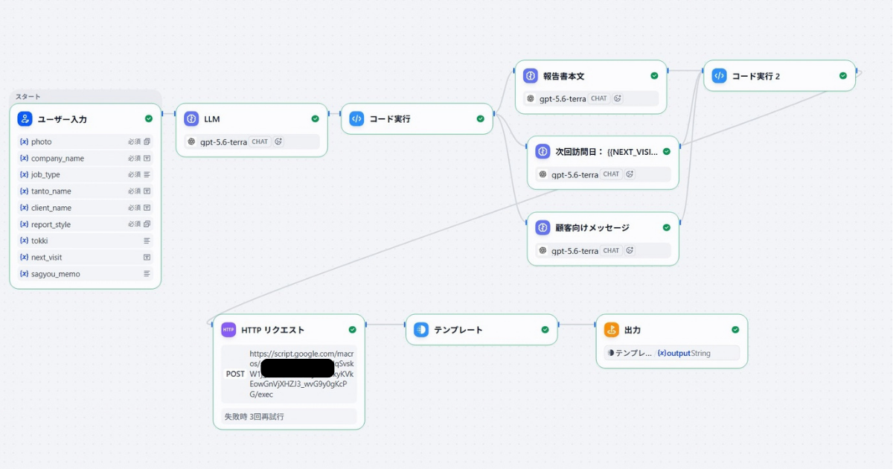
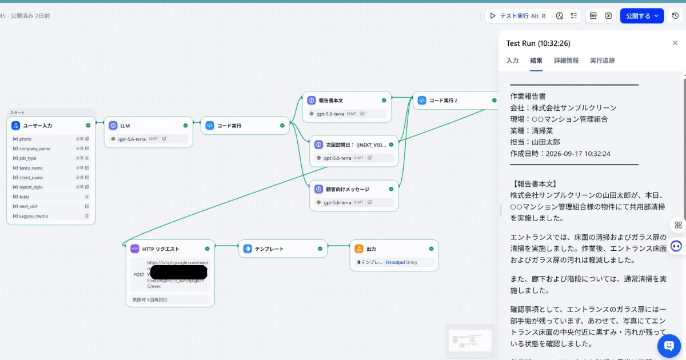

# AI報告書・顧客対応自動化システム

> ※本システムは、AIを活用した業務改善・自動化のポートフォリオとして構築した検証システムです。

## 概要

現場作業で発生する、報告書作成や顧客への報告、作業記録などの定型業務を、AIとGoogle Workspaceを組み合わせて効率化するシステムです。

写真と作業メモなどの現場情報を入力すると、AIが情報を整理し、報告書本文・次回作業の提案・顧客向けメッセージを生成します。

最終的な内容確認と必要な修正は、人が行うことを前提としています。

## 解決する業務

現場作業後に発生する以下の業務を効率化します。

* 現場写真や作業メモの確認
* 作業内容の整理
* 作業報告書の作成
* 次回作業の確認事項の整理
* 顧客向けメッセージの作成
* Googleスプレッドシートへの記録

## 業務フロー

### Before

```text
現場作業
↓
写真・作業メモを確認
↓
報告書を作成
↓
次回の注意点を整理
↓
顧客向けメッセージを作成
↓
スプレッドシートへ記録
```

### After

```text
写真＋作業メモ
↓
Difyで情報を整理
↓
報告書本文を生成
↓
次回作業の提案・注意点を生成
↓
顧客向けメッセージを生成
↓
Google Workspaceへ記録
↓
人が最終確認・必要に応じて修正
```

## システム構成

```text
現場写真
   ＋
作業メモ
   ↓
Dify
   ↓
AIによる情報整理
   ↓
┌────────────────┐
│ 報告書本文の生成       │
│ 次回作業の提案・注意点  │
│ 顧客向けメッセージ生成  │
└────────────────┘
   ↓
Google Workspace
   ↓
記録・帳票作成
```

## 使用技術

* Dify
* OpenAI API
* Google Apps Script（GAS）
* Google Sheets
* Google Drive
* Google Workspace

## Difyワークフロー

Dify上で、現場情報の整理から報告書・次回作業の提案・顧客向けメッセージの生成までをワークフロー化しています。



## 生成結果

実際にDifyワークフローを実行し、現場情報から報告書・次回作業の提案・顧客向けメッセージを生成しています。



生成された内容は、人が確認して必要に応じて修正する運用を想定しています。

## 想定する導入先

写真や定型情報をもとに、報告・記録などを行う業務への応用を想定しています。

* 清掃業
* リフォーム業
* 外構・造園業
* 設備業
* 建設関連業
* その他、現場写真を扱う業務

業務内容に合わせて、AIに任せる作業と人が判断する作業を切り分け、既存の業務フローへの応用を想定しています。

## AIを使用する際の考え方

AIが生成した文章を、そのまま無確認で使用することを前提としていません。

AIには情報整理や文章の下書きを任せ、人は最終的な内容確認と判断を行います。

AIですべてを自動化するのではなく、人が行っていた作業を減らし、確認・判断に集中できる状態を目指しています。

## ポートフォリオとしての目的

このシステムでは、単にAIで文章を生成するだけではなく、

* 現場情報の入力
* AIによる情報整理
* 業務文書の生成
* 顧客対応文の生成
* Google Workspaceとの連携
* 業務記録

までを一つのワークフローとして構築しています。

実際の業務内容に合わせて、AIに任せる作業と人が判断する作業を切り分けることを重視しています。

## 業務改善のご相談

現在行っている業務の中で、

* 写真を見ながら報告書を作成している
* 毎回同じ内容を入力している
* Excelやスプレッドシートへの転記が多い
* 顧客への報告文を毎回作成している
* 定型的な文章作成に時間がかかっている

といった業務があれば、AI・Dify・GAS・Make・Google Workspaceなどを組み合わせた効率化・自動化の方法を検討できます。

まずは「この作業はAIで自動化できる？」という段階からご相談いただけます。
